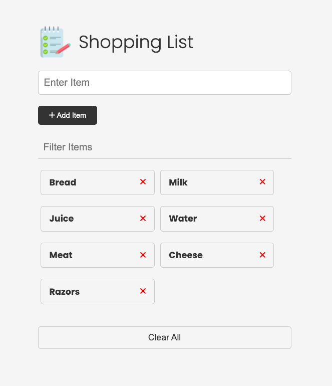

# Shopping List Website

Welcome to the Shopping List Website, a simple yet powerful tool to manage your grocery shopping.
Built with Vanilla JavaScript, HTML, and CSS, this application offers a user-friendly interface
for adding, removing, and filtering items on your shopping list.

## Deployment

The Shopping List Website is deployed via Netlify and is live
[HERE](https://master--magnificent-phoenix-49f7b7.netlify.app/).



## Features

- **Add Items:** Easily add new items to your shopping list with the input field and `Add Item` button.
- **Remove Items:** Each item has a remove button to delete it from the list.
- **Filter Items:** Dynamically filter through your items with real-time search functionality.
- **Persistent Storage:** Your shopping list is saved in the browser's local storage, so it remains
  available after you refresh the page.
- **Clear List:** With one click, you can clear all items from your shopping list.

## Structure

The website is structured with the following components:

- `index.html`: The main HTML document that structures the webpage.
- `style.css`: Contains all the styles used to make the website look great.
- `script.js`: The JavaScript file that contains the logic for adding, removing, and filtering items,
  as well as handling local storage.

## Usage

To use the website:

1. **Add an Item:** Type the name of the item in the input box and click `Add Item`.
2. **Remove an Item:** Click the red `x` button next to an item to remove it.
3. **Filter Items:** Type in the filter box to search through your items.
4. **Clear the List:** Click `Clear All` to remove all items from your list.

## Local Development

Clone the repository and open `index.html` in your browser to start using the app locally.

```bash
git clone https://github.com/WeslenLakins/shopping-list.git
cd shopping-list
open index.html
```

## Contributing

If you'd like to contribute to the project, feel free to fork the repository, make changes, and open a pull request!
